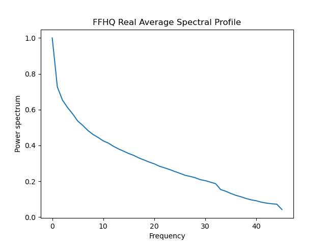

# CloakingScore: Spectral Distribution aware Image Generation

Official implementation of the CloakingScore suggested in our paper: TDA

# Dependencies

Tested on Python 3.8
<ul>
  <li>numpy 1.18.5</li>
  <li>matplotlib 3.2.2</li>
  <li>tqdm 4.46.1</li>
  <li>pytorch 1.5.1</li>
  <li>torchvision 0.6.1</li>
</ul>

# Usage

## SpectralTransform.py

Can be used to spectrally transform input tensors in an azimuthal fashion.
The file contains an example that transforms a given image folder into spectral profiles and caches them to disk.
To run, simply update the following parameters in the file:  `ffhq_real_path`, `file_real`, `device`

## CloakingScore.py

Use this file to compute the CloakingScore between real and fake images.
The file contains an example that computes the score between two image folders.
To run, simply update the following parameters in the file: `path_files_reals`, `path_files_fakes`
